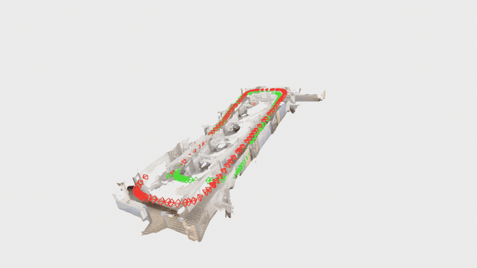

# slam/foundation — SOLiD × VGGT-SLAM

Geometry-only SOLiD place recognition integrated into
[VGGT-SLAM 2.0](https://github.com/MIT-SPARK/VGGT-SLAM). VGGT's predicted depth is
unprojected into a camera-frame point cloud; SOLiD retrieves loop candidates from
geometry only. RGB and intensity are disabled. VGGT-SLAM still estimates the loop
constraint and performs its normal SL(4) pose-graph optimization.

<div align="center">
  
  <br/>
  <sub>Common dense office map with trajectory/camera wireframes before (red) and after (green) loop closure.</sub>
</div>

## Result

On the bundled `office_loop` sequence (473 frames), the validated configuration
produces exactly one loop at the intended final revisit:

| Result | Value |
|---|---:|
| accepted loop | submap `204 -> 0` |
| SOLiD descriptor distance | `0.457` |
| odometry radius | `0.4` |
| VGGT image match ratio | `0.998` |
| false loops before final revisit | `0` |
| descriptor input | XYZ geometry only |

The radius search is an odometry-space candidate gate, not an RGB/intensity
feature. `SOLID_MIN_SUBMAP_GAP=50` prevents adjacent-submap matches.

## Files

| File | Purpose |
|---|---|
| `vggt_slam/pluggable_retrieval.py` | SALAD/NetVLAD/SOLiD retrieval backends and radius gate |
| `vggt_slam/o3d_loop_vis.py` | capture loop-before/loop-after maps and camera wireframes |
| `evals/render_o3d_loop_gif.py` | render both trajectories on one dense map, including slow figure-eight orbit |
| `vggt_slam_integration.patch` | changes required in VGGT-SLAM `main.py` and `solver.py` |
| `HANDOFF_solid_loop_closure.md` | experiments, reasoning, and detailed handoff |

## Install into VGGT-SLAM

From a clean VGGT-SLAM checkout:

```bash
git apply /path/to/SOLiD/slam/foundation/vggt_slam_integration.patch
cp /path/to/SOLiD/slam/foundation/vggt_slam/*.py vggt_slam/
cp /path/to/SOLiD/slam/foundation/evals/render_o3d_loop_gif.py evals/
pip install -e /path/to/SOLiD
```

The patch is based on VGGT-SLAM commit `35327ac`.

## Reproduce the validated office loop

```bash
VGGT_SEED=0 \
SOLID_NO_FLOOR=1 SOLID_CAMERA_Z_UP=1 SOLID_INTENSITY=0 SOLID_AZIMUTH=0 \
SOLID_MAX_RANGE=2.0 SOLID_NUM_RANGE=10 SOLID_NUM_HEIGHT=12 \
SOLID_FOV=30 SOLID_MIN_RANGE=0.05 SOLID_VOXEL=0.04 SOLID_SUB=6 \
SOLID_MEAN_REMOVE=0 SOLID_MIN_SUBMAP_GAP=50 SOLID_ODOM_RADIUS=0.4 \
SOLID_ICP_MIN=0 VGGT_IMG_THRES=0 \
python -u main.py --image_folder office_loop --submap_size 16 \
  --max_loops 1 --retrieval solid --lc_thres 0.55
```

To capture loop-before/after snapshots, append:

```bash
--o3d_lc_vis --o3d_lc_no_window --o3d_lc_dir o3d_loop_vis --o3d_lc_voxel 0.03
```

## Render the trajectory overlay

The following uses z-up coordinates, dense map points, strong elevation amplitude,
and one slow vertical cycle per orbit:

```bash
python evals/render_o3d_loop_gif.py \
  --before o3d_loop_vis/loop_01_before.npz \
  --after o3d_loop_vis/loop_01_after.npz \
  --map vggt_solid_poses_points.pcd --map-voxel 0.01 --cam-stride 2 \
  --camera-to-z-up --orbit-path figure8 \
  --elev 10 --elev-amp 28 --elev-cycles 1 \
  --frames 120 --fps 20 --point-size 2.0 \
  --out office_loop_before_after.gif
```

The elevation varies smoothly from `-18°` to `+38°`. The displayed dense map is
VGGT-SLAM's common reconstruction, not an externally measured ground-truth map.
