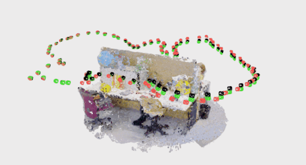
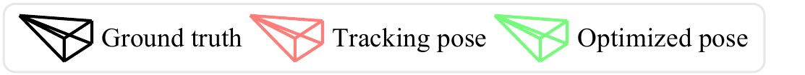
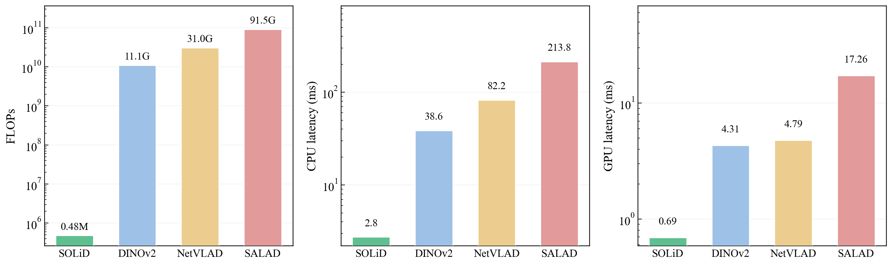

# slam/gaussiansplatting — SOLiD × LoopSplat

SOLiD as the **loop-closure place recognizer** for [LoopSplat](https://github.com/GradientSpaces/LoopSplat)
(RGB-D Gaussian-Splatting SLAM). Drop-in replacement for LoopSplat's NetVLAD.

<div align="center">
  
  <br/>
  
</div>

<p align="center"><sub>TUM fr3/office — the green (optimized) cameras snap onto the black GT the moment SOLiD detects the loop.</sub></p>

---

## The point: using SOLiD is this small

SOLiD is just an extractor. Feed it a **LiDAR-convention point cloud**
(`(N,3)` float32, sensor at the origin, **z = up / gravity**) and read back a
descriptor. Match places by cosine similarity of `rsolid`.

```python
import solid

ext = solid.Extractor(solid.load_config("gs_rgbd"))   # 1. one-time setup

d0 = ext.extract(cloud0)                               # 2. cloud (N,3) -> descriptor
d1 = ext.extract(cloud1)

score = solid.Extractor.loop_similarity(d0, d1)        # 3. cosine of rsolid  (higher = same place)
yaw   = solid.Extractor.pose_yaw_deg(d0, d1)           #    bonus: relative yaw (deg)
```

That is the whole API. Everything below is just *how a point cloud is produced*
from a given SLAM front-end.

### Plugging into a SLAM (LoopSplat example)

`solid_loopsplat.py` subclasses LoopSplat's `Loop_closure` and overrides **one
method** — `update_submaps_info` (build the descriptor from each keyframe's
back-projected depth). `detect_closure` / registration / PGO are inherited:

```python
from solid_loopsplat import SolidLoopClosure
gslam.loop_closer = SolidLoopClosure(config, gslam.dataset, gslam.logger)
```

Run any detector through the same pipeline:

```bash
python run_slam_lc.py --detector solid     # SOLiD
python run_slam_lc.py --detector netvlad   # LoopSplat default
python run_slam_lc.py --detector dinov2    # (visual baselines)
python run_slam_lc.py --detector salad
```

---

## Two things that make SOLiD work indoors

1. **LiDAR convention (z = up).** `rsolid` bins range in the x–y plane and
   elevation by z, so the cloud must be gravity-aligned (z up), sensor at the
   origin. `SolidLoopClosure` aligns via the **floor plane** (drift-invariant),
   falling back to the estimated pose.
2. **mean-removal.** `rsolid` is a non-negative range histogram, so every indoor
   scene shares a huge common component (cosine ≈ 0.9 for everything → aliasing).
   Subtracting the running-mean `rsolid` before normalizing ~doubles true/false
   separation (0.08 → 0.16 on fr3; 0.005 → 0.18 on fr1/desk). This is the single
   change that turns SOLiD from unusable to competitive indoors.

---

## Result (TUM fr3/office, loop-closed ATE vs the LoopSplat default)

| Detector | ATE after loop closure | descriptor time | device |
|---|---|---|---|
| **SOLiD** (mean-removal + floor-gravity) | **~1.9–2.2 cm** | **0.87 ms** | **CPU**, 0 learned params |
| NetVLAD (LoopSplat default) | 2.14 cm | 5.0 ms | GPU |
| DINOv2 / SALAD | 2.1 / 1.9 cm | 3.9 / 17 ms | GPU |

SOLiD is **competitive with the visual descriptors while being 5–20× faster and
CPU-only** — its real edge, on top of its native LiDAR/radar modality.

### Compute — a like-for-like comparison (everything in PyTorch)

<div align="center"></div>

`solid_torch.py` runs the *same* SOLiD algorithm as a torch op (matches the
C++/numpy backend, cos = 1.0), so it can be timed against the learned descriptors
on equal footing. SOLiD's `rsolid` is **0.48 MFLOPs — ~23,000× less than DINOv2
and ~190,000× less than SALAD** — and it is the fastest on **both** CPU and GPU.
Its compute is so small that a GPU gives no benefit (kernel-launch overhead > the
work), whereas the visual nets *need* a GPU. Reproduce: `python benchmark_compute.py`.

---

## Files

| file | what |
|---|---|
| `run_slam_lc.py` | one runner, `--detector {solid,netvlad,dinov2,salad}` |
| `solid_loopsplat.py` | `SolidLoopClosure` — SOLiD drop-in (floor-gravity, mean-removal, yaw-ICP) |
| `visual_loopsplat.py` | DINOv2 / SALAD variants (for the comparison) |
| `tune_auto.py` | fast recall/separation sweep of the `gs_rgbd` profile |
| `solid_torch.py` | SOLiD rsolid as a PyTorch op (CPU/GPU), matches the C++ backend |
| `benchmark_compute.py` | FLOPs + CPU/GPU latency comparison (the plot above) |
| `benchmark_pr.py` | per-descriptor timing benchmark |
| `make_map_cam_gif_o3d.py` | the map + before/after camera GIF above |
| `viser_view.py` | interactive viser viewer of a run's map + trajectory |

**Winning config:** `LC_MIN_SIM=0.35 LC_MIN_INTERVAL=10 SOLID_USE_YAW=1 LC_MIN_OVERLAP=0.4`
with the tuned `gs_rgbd` profile (max_range 10, num_range 40, num_height 40, fov ±15).
